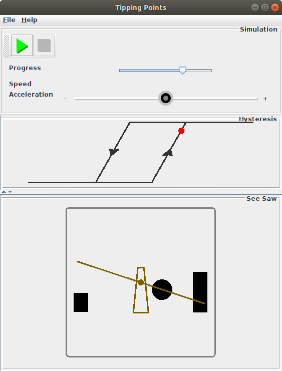

# Dear visitor,

welcome to this website on tipping points!

The “Tipping Points” project is a contribution to the supporting
programme of the ZKM [exhibition “Critical
Zones”](critical-zones.html) via the [Artists4Future network
initiative](artists4future.html).  It aims at depicting and clarifying
one of the most essential aspects of climate change, namely
demonstrating why returning back to previous state after passing a
critical point is extremely hard.  Using an extra primed seesaw as
illustrative example, it demonstrates the effect of so-called
“hysteresis”: After having passed the point when the seesaw tips over
onto the other side, the effort for restoring the original state is
multiple times hight than the effort that was carried out to get into
the changed state.  Technically, the hysteresis effect is achieved
with a free rolling ball integrated into the inner parts of the
seesaw, thus serving as additional, feeding back mass.

Translated to climate change, the hysteresis means that after having
emitted some specific amount of carbon dioxid (CO₂) into our
environment, it will not at all be sufficient to revert the effect by
removing the overshoot amount of CO₂.  Instead, a multiple of that
amount would have to be removed from the air, which is an obviously
non-feasible scenario, given the way, our current economic system
works, as illustrated by the fact that we fail to fulfill even the
weakest climate goals.

Following and evaluating incountable discssions in social media, I
have come to the conclusion that obviously only few people, mostly
technical experts, have an idea about the hysteresis effect and its
impact on how to deal with climate change, thus resulting in invalid
assumptions in most discussions.  Even most decision-makers in
politics and economy do not at all seem to grasp what a hysteresis is
and what impacts it has, thus leading to invalid assumptions for
decision memos and finally resulting in fatal decisions that will
entail irreversible destruction of our environment referring to the
era of our human civilzation and culture.

This is where the “Tipping Points” project comes in with illustrative
elucidation on technical aspects, in order to counteract the
threatening irreversible destruction.
